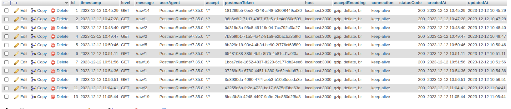

npm i express-rate-limit

npm install express-rate-limit 

rate limit added for one minutes, you can hit 10 api within one minutes, and it will disable after one minute of activation

Rate limiting is a technique used to control the number of requests a client (or IP address) can make to your API within a specified time window. This helps prevent abuse, ensures fair usage, and protects your server from being overwhelme

documentation: https://www.npmjs.com/package/express-rate-limit

endPoints

http://localhost:3000/raw/1
http://localhost:3000/raw/2
http://localhost:3000/raw/3
http://localhost:3000/raw/4
http://localhost:3000/raw/5
http://localhost:3000/raw/6
http://localhost:3000/raw/7
http://localhost:3000/raw/8
http://localhost:3000/raw/9
http://localhost:3000/raw/10
http://localhost:3000/raw/11
http://localhost:3000/raw/12
http://localhost:3000/raw/13
http://localhost:3000/raw/14
http://localhost:3000/raw/15
http://localhost:3000/raw/16
http://localhost:3000/raw/17
http://localhost:3000/raw/18
http://localhost:3000/raw/19

response middleware added...

winston npm module added... it is used to log the information about the request that is made timestamp etc the things related to the request made.

api.log file is saving the log locally in the project folder.

<!-- another method to log the things into the database with sequelize without using any npm module -->
import LogModel from '../models/apiLog.js';
const logRequestDetails = (req, res, next) => {
  const logData = {
    level: req.method,
    message: ${req.url},
    meta: req.body,
  };
  res.on('finish', () => {
    logData.statusCode = res.statusCode;
    // Log the request details using the LogModel and Sequelize
    LogModel.create(logData)
      .then(() => {
        console.log('Log entry saved successfully');
      })
      .catch((error) => {
        console.error('Error saving log entry to Sequelize:', error);
      });
  });
  next();
};
export default logRequestDetails;